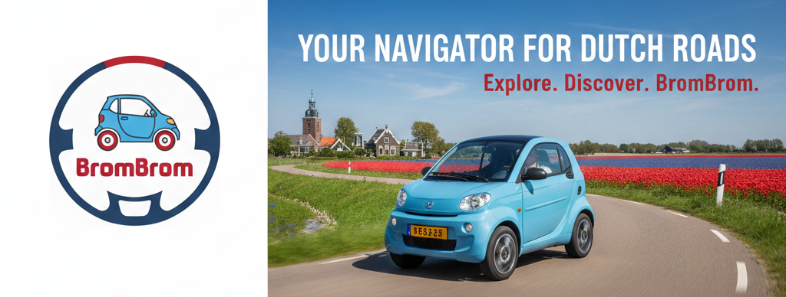

<p align="center">
  
</p>

# BromBrom: OsmAnd Microcar Navigation (Netherlands)

**BromBrom** creates a professional-grade **OsmAnd** navigation package specifically for L6e microcars (*Brommobielen*) in the Netherlands. It solves the unique routing challenges of microcars by rigorously excluding forbidden roads (C9 signs, motorways) from the map data using official NDW traffic data and OpenStreetMap.

OsmAnd is a free and open-source offline navigation app for Android and iOS: https://osmand.net.

## 📲 Download the Navigation Package

*Skip the build process. Download the latest official monthly package for your phone.*

**[Download BromBrom for OsmAnd (latest release)](https://github.com/tbulligan/brombrom/releases/latest)**

> **☕ Support the Project**: If BromBrom has helped you navigate safely and saved you from a fine or a motorway, [consider buying me a coffee](https://buymeacoffee.com/brombrom) to support its continued maintenance.

---

## ✨ Features

- **Advanced Routing Engine**: Generates a custom `.obf` map for OsmAnd with "C9-forbidden" tags baked into the road network.
- **Intelligent Restriction Logic**: Handles Dutch C9 traffic signs by verifying supplementary plates; roads with `OB65` (microcar exception) remain accessible.
- **Automated Lifecycle**: A fresh navigation package is autogenerated every month to stay in sync with government traffic data.
- **Premium Experience**: Full support for OsmAnd voice guidance, lane assistance, and (with OsmAnd Pro) **Android Auto** dashboard integration.
- **Zero-Touch Deployment**: Ready-to-use zip file with all maps, routing rules, and configurations included.

---

## 🚀 Getting Started

### Prerequisites
- **OsmAnd** (Android / iOS app): R\required for using the generated maps. Available on Google Play, F-Droid, Apple app Store.
- **Docker**: with BuildKit support.
- **System Memory**: At least **6GB RAM** is required for the map generation stage.

> [!NOTE]
> BromBrom on iOS is currently experimental.

### 1. Build the Map
```bash
# Clone and enter the repo
git clone https://github.com/tbulligan/brombrom.git
cd brombrom

# Build the builder image
docker buildx build -t brombrom-builder .

# Run the pipeline (downloads ~1.5GB data on first run)
docker run --rm -v $(pwd):/app brombrom-builder
```
Find your artifact `brombrom_osmand_deploy.zip` in the `dist/` folder.

### 2. Installation on Android (OsmAnd)
1. Connect your phone to your PC.
2. Unzip `brombrom_osmand_deploy.zip` to the **root** of your internal storage.
3. **Setup OsmAnd**:
   - Open OsmAnd -> Settings -> Profiles -> [Select Profile] -> Navigation settings -> Route parameters -> **Navigation type**.
   - Select **`routing.xml`** (may appear as *microcar*).
> **Note**: BromBrom generates a custom `.obf` map file. Once it's in the correct OsmAnd folder, it will be automatically detected and used for routing.

### Experimental: iOS Support
The generated `.obf` and `routing.xml` files are cross-platform and theoretically work on **OsmAnd for iOS**. However, because iOS lacks the direct file structure of Android, you must manually import the files:
- Transfer the `.obf` and `routing.xml` files from the zip to your iPhone (via AirDrop, iCloud, or Files app).
- Open them with the OsmAnd app to import.
- Note: This path is currently manual and experimental.

---

## 🧠 How it Works & Safety

### Under the Hood
BromBrom doesn't just "prefer" certain roads; it programmatically enforces legal restrictions:
1. **Data Fusion**: Combines latest **OpenStreetMap** data with the **NDW** live traffic sign database.
2. **Directional Snapping**: Signs are snapped to roads using orientation logic to ensure the correct side of the road is blocked.
3. **Semantic Tagging**: Injects `motor_vehicle=no` and `microcar=no` tags directly into the road network.
4. **Hard Blocking**: The routing engine treats these roads as physically inaccessible for your vehicle type.

### Safety & Resilience (What if I get lost?)
If you mistakenly enter a forbidden road (e.g., following traffic or missing a sign):
- **GPS Snapping**: The app will try to "snap" your position to the nearest **legal** road on the map.
- **Beeline Recovery**: If you are too far from a legal road, OsmAnd shows a "beeline" to the nearest exit point. guidance resumes once you reach a permitted street.
- **Legal Safety**: The app will never plan a route through a C9 road or use one as a shortcut. If you accidentally end up on a restricted road, the app will immediately guide you to the nearest legal exit. **Crucially: Digital maps can have errors; if you see a physical C9 sign, always obey the sign over the app.**

---

## 🗺️ Primary Navigation: OsmAnd

OsmAnd is the **required** primary experience for BromBrom. By baking the C9 and motorway restrictions directly into the `.obf` map data, OsmAnd provides:
- **Android Auto Support**: Seamless dashboard integration (requires OsmAnd Pro).
- **Full Voice Guidance**: Street names and turn instructions.
- **Lane Assistance**: Visual indicators for complex intersections.
- **Offline Reliability**: 100% offline navigation without data usage.

---

## 🛠️ Optional: BRouter (Developer / Backup)

While OsmAnd is the primary engine, BRouter is supported as an **optional** secondary fallback or for technical auditing. 
Specify the environment variable to generate BRouter segments:
```bash
docker run --rm -v $(pwd):/app -e INCLUDE_BROUTER=true brombrom-builder
```
**Setup**: Open the BRouter app -> Select `brommobiel` profile -> Set to **Server-Mode**.

---

## 📈 Performance & Build Notes

- **Initial Build**: Downloads ~1.5GB of geospatial data. Ensure a stable connection.
- **OsmAnd OBF Generation**: This is the most resource-intensive part.
  - **Memory**: It is configured to use up to **6GB** of RAM (compatible with GitHub free runners).
  - **Duration**: 20-40 minutes depending on hardware.
  - **Feedback**: Progress over 100% (e.g., `Done 450%`) is normal as it cycles through data layers.
- **Idempotency**: The pipeline skips finished stages. Run `./clean.sh` for a fresh start.

---

## 📂 Project Structure
- `scripts/`: Python ETL pipelines (Fetching, Snapping, Tagging).
- `config/`: Routing profiles (`.brf`) and XML configurations.
- `Dockerfile`: Multi-stage build environment.

---

## ⚖️ License & Legal

### Data Attributions
- **Map Data**: © [OpenStreetMap contributors](https://www.openstreetmap.org/copyright) (ODbL).
- **Traffic signs**: Provided by [NDW](https://www.ndw.nu/) (Nationaal Dataportaal Wegverkeer).

### Project License
© 2026 Tomaso Bulligan. All Rights Reserved.
**Personal, non-commercial use only.** Redistribution or commercial exploitation is strictly prohibited without prior written consent.
