<p align="center">
  
</p>

# BromBrom: OsmAnd Microcar Navigation (Netherlands)

> [!IMPORTANT]
> BromBrom is a *planning aid* only. You are responsible for following traffic signs and Dutch law.

[](https://github.com/tbulligan/brombrom/releases/latest)
[](https://brombrom.bulligan.com/)

**BromBrom** creates a professional-grade **OsmAnd** navigation package specifically for L6e microcars (*Brommobielen*) in the Netherlands. It solves the unique routing challenges of microcars by rigorously excluding forbidden roads (C9 signs, motorways) from the map data using official NDW traffic data and OpenStreetMap.

OsmAnd is a free and open-source offline navigation app for Android and iOS: https://osmand.net.

## ✨ Features

- **Advanced Routing Engine**: Custom `.obf` maps with "C9-forbidden" tags baked into the road network.
- **Intelligent Restriction Logic**: Handles Dutch C9 signs using official NDW data; respects microcar exceptions (`OB65`).
- **Monthly Updates**: Fresh navigation packages autogenerated on the 2nd of every month.
- **Premium Experience**: Full support for voice guidance, lane assistance, and **Android Auto** (with OsmAnd Pro).
- **Zero-Touch Deployment**: [Latest files](https://github.com/tbulligan/brombrom/releases/latest) ready for your phone.

> **Support the Project**: If BromBrom helps you navigate safely, [consider buying me a coffee ☕](https://buymeacoffee.com/brombrom).

---

## 📸 Routing Comparison (Auto vs. Brommobiel)

See the difference: standard car navigation would route you onto expressways or forbidden C9 roads (left), whereas BromBrom routing avoids them automatically (right).

| Car Routing (Forbidden) | BromBrom Routing (Legal & Safe) |
| :---: | :---: |
| 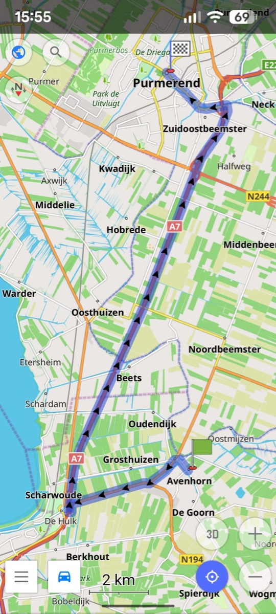 | 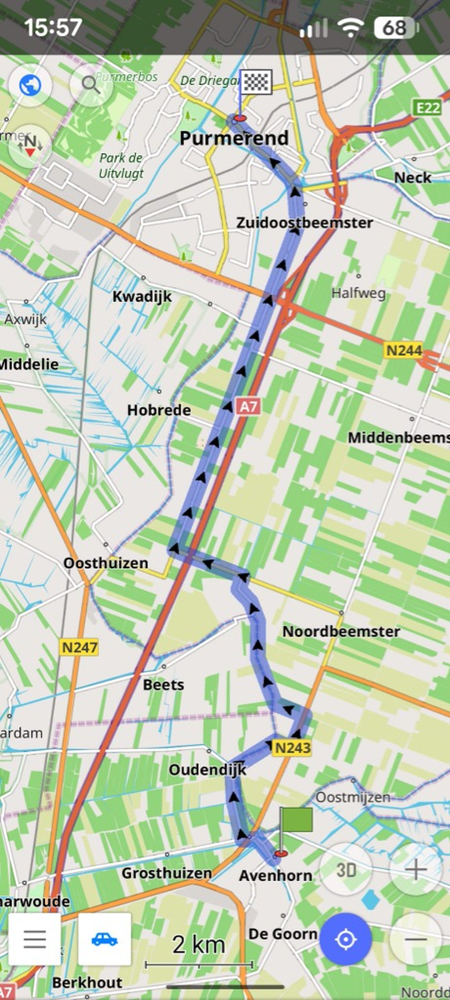 |

---


## 📲 Installation & Setup

> [!IMPORTANT]
> **Prerequisite**: You must have **OsmAnd** installed on your device first. Download it from the [Google Play Store](https://play.google.com/store/apps/details?id=net.osmand) or [iOS App Store](https://apps.apple.com/app/osmand-maps-navigation/id934850257).

### ✅ Option A: BromBrom Manager (Android Recommended)
The fastest way to install and keep your navigation updated automatically.

> [!TIP]
> **Already Configured?** If you have already set up the BromBrom profile in OsmAnd, you only need to perform **Phase 1: Installation & Import**. OsmAnd will automatically retain your settings and profile choice for updates!

#### Phase 1: Installation & Import (Required Every Month)
1.  **Download** the **BromBrom Manager App** from the **[latest release](https://github.com/tbulligan/brombrom/releases/latest)**.
2.  **Install** and **Open** the app.
3.  **Download & Import**: The app automatically checks for and downloads the update. Once downloaded, review the popup instructions and tap **"OPEN OSMAND"**.
4.  OsmAnd will open. Check both **"Settings"** and **"Resources"**, then tap **"Continue"**.
5.  Tap **"Replace all"** (overwrite) or **"Apply"** (first time) and wait for the import to finish.
6.  On the **"Import complete"** screen, tap **"Close"**.

<details>
  <summary>📸 Step-by-Step Screenshots: Phase 1 (Installation & Import)</summary>

  | 1. Updates Available | 2. Open with OsmAnd | 3. Select Resources to Import |
  | :---: | :---: | :---: |
  | 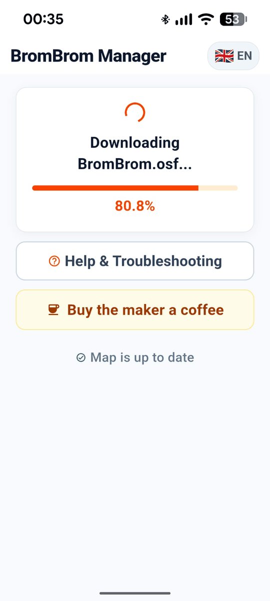 | 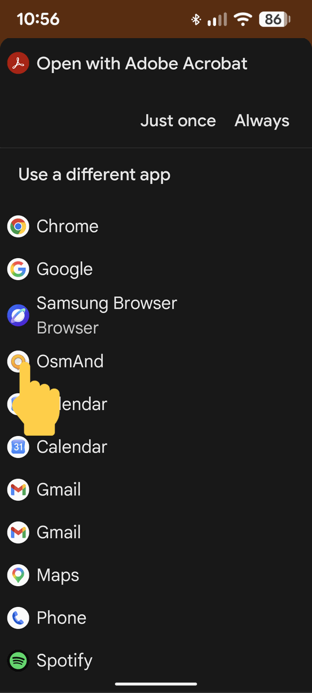 | 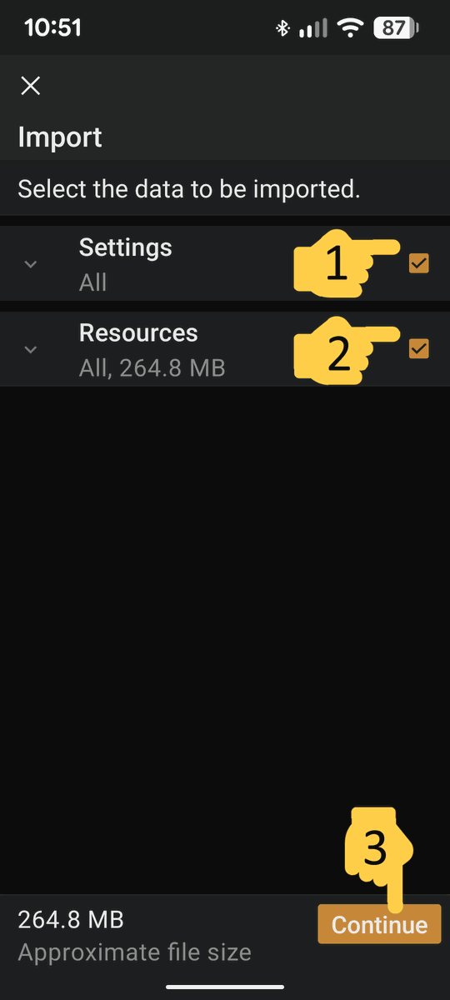 |

  | 4. Confirm Replacement (If asked) | 5. Import Complete (Tap Close) |
  | :---: | :---: |
  | 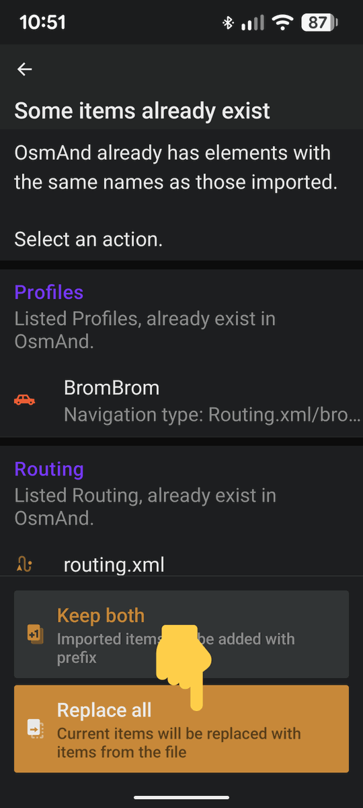 | 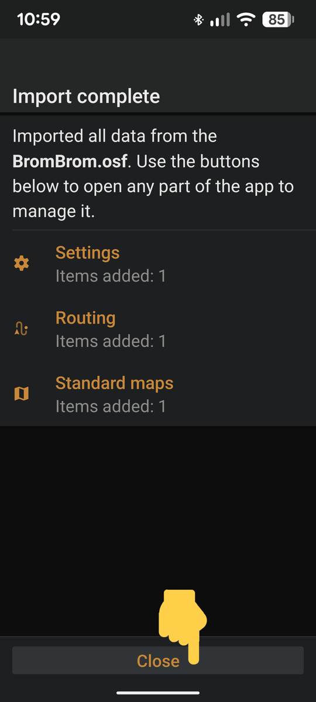 |
</details>

#### Phase 2: Profile Activation (First-Time Installation Only)
If this is your first time installing BromBrom, you must activate the profile:

7.  Open the OsmAnd menu (three lines button in the corner).
8.  Go to **Settings** -> **Configure profiles**.
9.  **Enable BromBrom** — Scroll down to the profiles list, find **BromBrom** and toggle it **ON**.
10. Tap the navigation icon and select the **BromBrom** profile (orange microcar icon).

<details>
  <summary>📸 Step-by-Step Screenshots: Phase 2 (Profile Activation)</summary>

  | 1. Open Menu | 2. Open Settings |
  | :---: | :---: |
  | 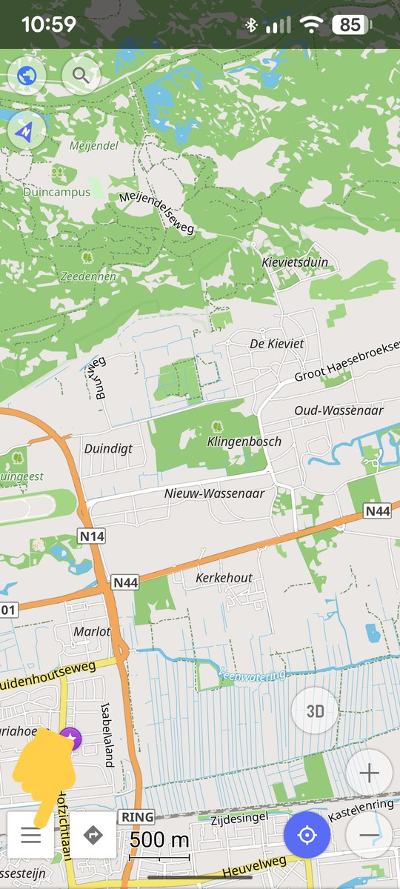 | 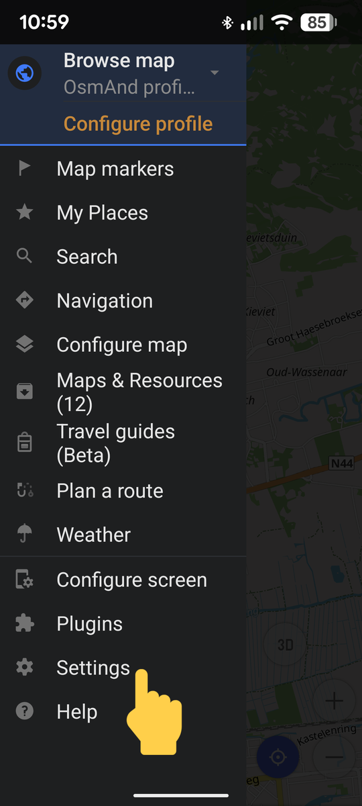 |

  | 3. Enable BromBrom | 4. Select BromBrom Profile |
  | :---: | :---: |
  | 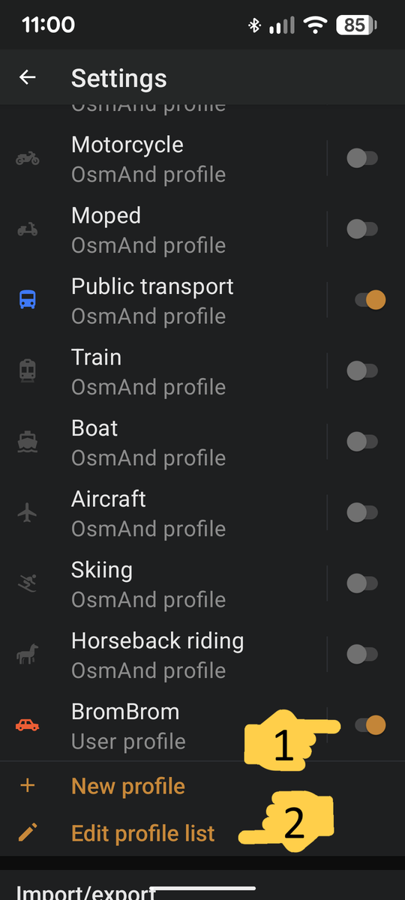 | 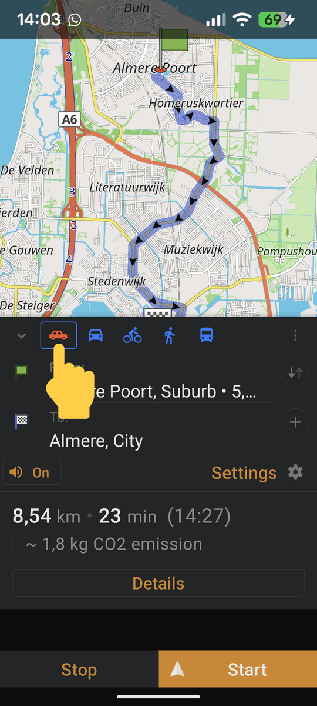 |
</details>


### 🍏 Option B: Direct Import (iOS & Advanced Android Users)
Because the entire BromBrom profile is packaged into a Smart Folder (`.osf`), manual installation is easy across all operating systems.

1. Go to the **[latest release](https://github.com/tbulligan/brombrom/releases/latest)** on your phone.
2. Download the **`BromBrom.osf`** package file.
3. Tap on the downloaded file. Your OS will prompt you to open it with **OsmAnd**.
4. Check both **"Settings"** and **"Resources"**, then tap **"Continue"**.
5. Tap **"Replace all"** (update) or **"Apply"** (first time) and wait for the import to finish.
6. On the **"Import complete"** screen, tap **"Close"**.
7. Open the OsmAnd menu (three lines in the corner) and go to **Settings**.
8.  **Enable BromBrom** — Scroll down to the profiles list, find **BromBrom** and toggle it **ON**.
9.  In the navigation menu, select the **BromBrom** profile (orange microcar icon).

> ⚠️ Do not skip steps 6–8. OsmAnd does not enable or activate new profiles automatically.

See the [Manual Install Guide](docs/manual_install.md) for deeper troubleshooting.

---

## 🧪 Testing & QA

We ensure road safety through a combination of unit tests and post-build validation.

- **Fast Iteration**: We use `pytest` for unit testing the core ETL logic.
- **Visual Audit**: In `DEBUG` mode, we generate `debug_snaps.gpkg` for spatial verification.
- **Build Guard**: Automated QA script `validate_results.py` checks artifact integrity.

> [!TIP]
> **Run Tests**: `pytest`
> **Learn More**: See [Testing & QA Architecture](docs/testing.md).

---

## 🔬 Core Algorithms
The heart of BromBrom is its directional snapping and exemption parsing logic. 
- **Snapping**: Uses 2D cross-products to determine the correct side of the road. See [Snapping & Spatial Logic](docs/snapping_logic.md).
- **Exceptions**: Handles complex Dutch signage like `OB65` and OCR-prone text.

---

## 🧠 How it Works & Safety

### Under the Hood
BromBrom doesn't just "prefer" certain roads; it programmatically enforces legal restrictions:
1. **Data Fusion**: Combines latest **OpenStreetMap** data with the **NDW** live traffic sign database.
2. **Directional Snapping**: Signs are snapped to roads using orientation logic to ensure the correct side of the road is blocked.
3. **Semantic Tagging**: Injects `motor_vehicle=no` and `microcar=no` tags directly into the road network.
4. **Hard Blocking**: The routing engine treats these roads as physically inaccessible for your vehicle type.

### Safety & Resilience
If you mistakenly enter a forbidden road (e.g., following traffic or missing a sign):
- **GPS Snapping**: The app will try to "snap" your position to the nearest **legal** road on the map.
- **Legal Safety**: The app will never plan a route through a C9 road. If you end up on a restricted road, the app will guide you to the nearest legal exit. **Always obey physical signs over the app.**

---

## 🛠️ Development & Source Build

### Option A: Native (Fastest)
1. **Setup Environment**: `micromamba env create -f environment.yml`
2. **Install Tools**: `./scripts/setup_tools.sh`
3. **Run Build**: `./run_full_build.sh`

### Option B: Docker (Source of Truth)
```bash
docker buildx build -t brombrom-builder .
docker run --rm -v $(pwd):/app brombrom-builder
```

---

## 📂 Project Structure
- `scripts/`: Python ETL pipelines (Fetching, Snapping, Tagging).
- `config/`: Routing profiles (`.brf`) and XML configurations.
- `app/`: Source code for the BromBrom Manager (Flutter).
- `tests/`: Unit tests for critical spatial logic.

---

## ⚖️ License & Legal

### Data Attributions
- **Map Data**: © [OpenStreetMap contributors](https://www.openstreetmap.org/copyright) (ODbL).
- **Traffic signs**: Provided by [NDW](https://www.ndw.nu/) (Nationaal Dataportaal Wegverkeer).

### Project License
© 2026 Tomaso Bulligan. All Rights Reserved. **Personal, non-commercial use only.**
