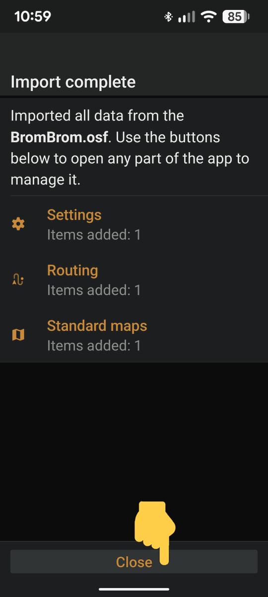
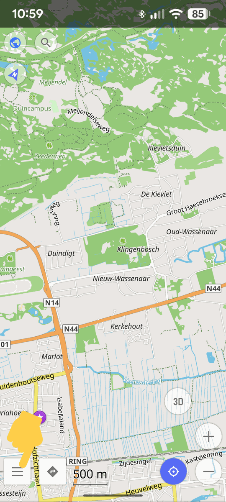
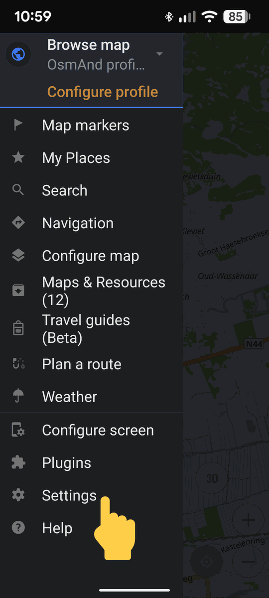
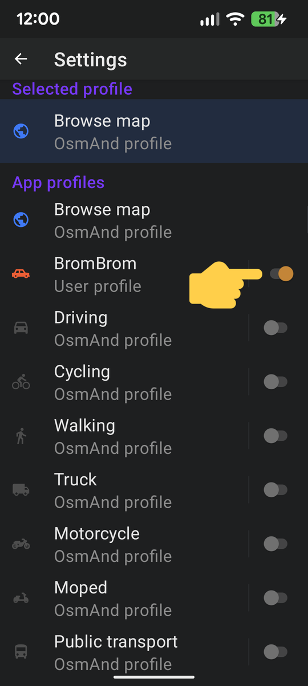

# Manual Installation Guide (Advanced / iOS)

> [!IMPORTANT]
> **Prerequisite**: Ensure **[OsmAnd](https://www.osmand.net/)** is installed before proceeding.

Because the entire BromBrom profile is securely packaged into a Smart Folder (`.osf`), manual installation is easy across all operating systems.

## 🍏 iOS Devices (iPhone / iPad)

The iOS version of [OsmAnd](https://www.osmand.net/) natively supports OsmAnd Smart Folders (`.osf`).

> [!TIP]
> **Already Configured?** If you have already set up the BromBrom profile in [OsmAnd](https://www.osmand.net/), you only need to perform **Phase 1: Installation & Import**. [OsmAnd](https://www.osmand.net/) will automatically retain your settings and profile choice for updates!

#### Phase 1: Installation & Import (Required for Updates)
1. Open Safari on your iPhone and go to the **[latest release](https://github.com/tbulligan/brombrom/releases/latest)**.
2. Under "Assets", tap and download **`BromBrom.osf`**.
3. Once downloaded, tap the file. Safari will prompt you to open it with **[OsmAnd](https://www.osmand.net/)**.
4. Check both **"Settings"** and **"Resources"**, then tap **"Continue"**.
5. Tap **"Replace all"** (overwrite) or **"Apply"** (first time) and wait for the import to finish.
6. On the **"Import complete"** screen, tap **"Close"**.

#### Phase 2: Profile Activation (First-Time Installation Only)
7. Open the [OsmAnd](https://www.osmand.net/) menu (three lines button in the corner).
8. Go to **Settings** -> **Configure profiles**.
9. **Enable BromBrom & Disable Others** — Set **BromBrom** to **ON** (orange) and switch all other profiles to **OFF** (grey). OsmAnd will now exclusively use BromBrom for navigation.

> ⚠️ **Do not skip steps 7–9** — [OsmAnd](https://www.osmand.net/) does not enable new profiles automatically.

## 🤖 Android Devices (Without Manager App)

If you prefer not to use the BromBrom Manager app, you can achieve the exact same result manually.

> [!TIP]
> **Already Configured?** If you have already set up the BromBrom profile in [OsmAnd](https://www.osmand.net/), you only need to perform **Phase 1: Installation & Import**. [OsmAnd](https://www.osmand.net/) will automatically retain your settings and profile choice for updates!

#### Phase 1: Installation & Import (Required for Updates)
1. Go to the **[latest release](https://github.com/tbulligan/brombrom/releases/latest)** on your phone's browser.
2. Download the **`BromBrom.osf`** package file.
3. Open your phone's "Files" or "Downloads" app and tap on `BromBrom.osf`.
4. Your OS will prompt you to open it with **[OsmAnd](https://www.osmand.net/)**.
5. Check both **"Settings"** and **"Resources"**, then tap **"Continue"**.
6. Tap **"Replace all"** (overwrite) or **"Apply"** (first time) and wait for the import to finish.
7. On the **"Import complete"** screen, tap **"Close"**.

#### Phase 2: Profile Activation (First-Time Installation Only)
8. Open the [OsmAnd](https://www.osmand.net/) menu (three lines button in the corner).
9. Go to **Settings** -> **Configure profiles**.
10. **Enable BromBrom & Disable Others** — Set **BromBrom** to **ON** (orange) and switch all other profiles to **OFF** (grey). OsmAnd will now exclusively use BromBrom for navigation.

> ⚠️ **Do not skip steps 8–10** — [OsmAnd](https://www.osmand.net/) does not enable new profiles automatically.

## 📸 Visual Setup Guide

Refer to these screenshots to verify your setup steps.

  
Phase 1: Importing BromBrom.osf into OsmAnd

  | 1. Open with [OsmAnd](https://www.osmand.net/) | 2. Select Resources to Import | 3. Confirm Replacement (If asked) |
  | :---: | :---: | :---: |
  |  |  |  |

  | 4. Import Complete (Tap Close) |
  | :---: |
  |  |

  
Phase 2: Activating the BromBrom Profile

  | 1. Open Menu | 2. Open Settings | 3. Enable BromBrom & Disable Others |
  | :---: | :---: | :---: |
  |  |  |  |

## 🔄 Updates

To update, simply download the newest `BromBrom.osf` and tap it. When [OsmAnd](https://www.osmand.net/) prompts you during the import, check both **"Settings"** and **"Resources"**, then tap **"Continue"** → **"Replace all"**. It will automatically overwrite the old map and routing rules with the fresh data.

> **Troubleshooting Import/Open Failures**: If nothing happens or the import dialog fails to appear when opening the file, ensure that **[OsmAnd](https://www.osmand.net/) is completely closed** (swiped away from your phone's recent/background apps) before trying again. This ensures [OsmAnd](https://www.osmand.net/) starts fresh and processes the file import intent immediately.

---

## 🧭 Optional: Scenic & Quiet Routes (Avoid Busy Roads)

To avoid busy roads and prioritize calm, scenic routes:
1. Start route navigation in OsmAnd with the **BromBrom** profile selected.
2. Tap **Options** (gear icon in the route navigation sheet).
3. Open **Route parameters** (or *Avoid roads...*).
4. Enable **"Drukke wegen vermijden"**.
5. OsmAnd will automatically calculate calm routes along secondary roads and dykes.
